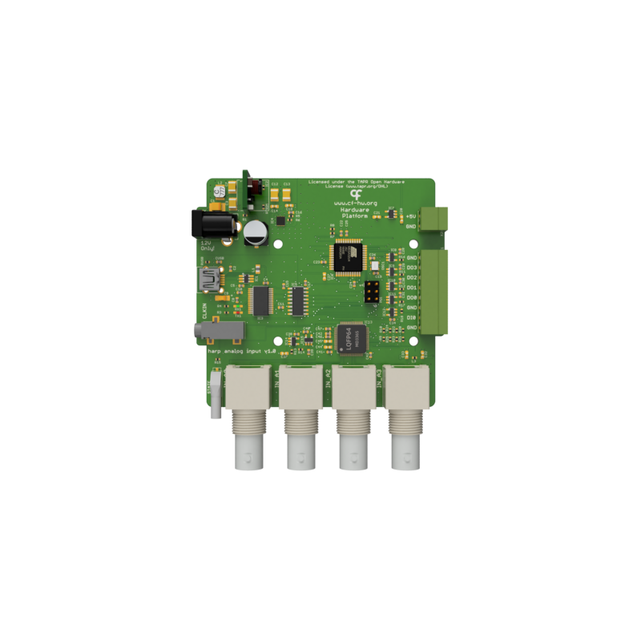

## Harp Analog Input

This device samples simultaneously up to 4 analog signals with 16 bits resolution, low noise and and analog input range of ±10 V for all channels.

### Key Features ###

* 4 ADC channels
* 16bit resolution with an input range of +-10V
* Simultaneous acquisition of all channels
* Threshold detection and event generation

### Connectivity ###

* 4 BNC connectors for analog input
* I/O connector for TTL signals

## Interface ##

The interface with the Harp board can be done through [Bonsai](https://bonsai-rx.org/)

## Licensing ##

Each subdirectory will contain a license or, possibly, a set of licenses if it involves both hardware and software.
